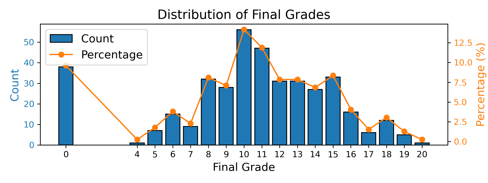

<div align="center">

# Bayesian Optimization Comparison


</div>

Ever wondered which bayesian optimization framework to use for your project? We try to help you with that :)  

> This repository provides a general comparison of different [bayesian optimization](https://en.wikipedia.org/wiki/Bayesian_optimization) frameworks. 

## :books: Table of Contents
- [Bayesian Optimization Comparison](#bayesian-optimization-comparison)
  - [:books: Table of Contents](#books-table-of-contents)
  - [:dart: Summary](#dart-summary)
  - [Installation](#installation)
  - [:bulb: Library Descriptions](#bulb-library-descriptions)
    - [:one: Optuna](#one-optuna)
    - [:two: BayesianOptimization](#two-bayesianoptimization)
    - [:three: BayesSearchCV](#three-bayessearchcv)
    - [:four: hyperopt](#four-hyperopt)
    - [:five: gp\_minimize](#five-gp_minimize)
  - [:pencil: My Notes](#pencil-my-notes)
  - [:calendar: ToDo's](#calendar-todos)

## :dart: Summary

We used [Kaggles student alcohol consumption datasets](https://www.kaggle.com/datasets/uciml/student-alcohol-consumption). The objective was to predict the final exam grade (column `G3`) of students.



The dataset was partitioned into a train/test_val split using a 10-fold scheme. Within each train/test_val split, we performed an inner 5-fold cross-validation for hyperparameter tuning and model selection. The following table provides the confidence intervals of the 10 outer folds on the test set. We searched in 300 different parameter combinations for each library.

| Library :robot:        | Tune Time :hourglass: | Accuracy | Recall | F1-Score | Notebook :closed_book: | 
| ---------------------- | ---- | ---- | ---- | ---- | ---- |
| `Optuna`               | | <span style="color: grey;">Train:</span> $X \pm Y$ <br> <span style="color: grey;">Test:</span> | <span style="color: grey;">Train:</span> <br> <span style="color: grey;">Test:</span> | <span style="color: grey;">Train:</span> <br> <span style="color: grey;">Test:</span> | [optuna.ipynb](notebooks/optuna.ipynb) |
| `BayesianOptimization` | | <span style="color: grey;">Train:</span> <br> <span style="color: grey;">Test:</span> | <span style="color: grey;">Train:</span> <br> <span style="color: grey;">Test:</span> | <span style="color: grey;">Train:</span> <br> <span style="color: grey;">Test:</span> |  |
| `BayesSearchCV`        | | <span style="color: grey;">Train:</span> <br> <span style="color: grey;">Test:</span> | <span style="color: grey;">Train:</span> <br> <span style="color: grey;">Test:</span> | <span style="color: grey;">Train:</span> <br> <span style="color: grey;">Test:</span> |  |
| `hyperopt`             | | <span style="color: grey;">Train:</span> <br> <span style="color: grey;">Test:</span> | <span style="color: grey;">Train:</span> <br> <span style="color: grey;">Test:</span> | <span style="color: grey;">Train:</span> <br> <span style="color: grey;">Test:</span> |  |
| `gp_minimize`          | | <span style="color: grey;">Train:</span> <br> <span style="color: grey;">Test:</span> | <span style="color: grey;">Train:</span> <br> <span style="color: grey;">Test:</span> | <span style="color: grey;">Train:</span> <br> <span style="color: grey;">Test:</span> |  |

## Installation

To install the conda environment with conda, run the following command:

```bash
conda env create -f environment.yml
```

## :bulb: Library Descriptions
### :one: [Optuna](https://optuna.org/)

```bash
# Pip
% pip install optuna
# Conda
% conda install -c conda-forge optuna
```

In Optuna you need to define an objective, create a study via [create_study]() and optimize your objective. An example implementation would be as follows:

```python
def objective(trial):
    # Defining the hyperparameter search space.
    n_estimators = trial.suggest_int('n_estimators', 50, 300)
    # ...
    
    # Build the pipeline
    clf = RandomForestClassifier(n_estimators=n_estimators,
                                 # ...  
                                 )
    
    clf.fit(X_train, y_train)
    y_pred = clf.predict(X_val)
    acc = accuracy_score(y_val, y_pred)
    
    return acc

# Creating a study and running Optuna optimization.
study = optuna.create_study(study_name='my_optuna_study',
                            direction='maximize')
study.optimize(objective, 
               n_trials=100)

# Obtain the best found parameters.
best_params = study.best_params
```


While tuning Optuna provides logs in the following format. This shows the log of the 1st, 150th and last trial:

```
[I 2023-08-07 16:07:39,539] A new study created in memory with name: my_optuna_study
[I 2023-08-07 16:07:39,809] Trial 0 finished with value: 0.1864406779661017 and parameters: {'n_estimators': 158, 'max_depth': 10, 'min_samples_split': 0.578748660317236, 'min_samples_leaf': 0.12410371173766938}. Best is trial 0 with value: 0.1864406779661017.
...
[I 2023-08-07 16:08:21,456] Trial 150 finished with value: 0.1694915254237288 and parameters: {'n_estimators': 271, 'max_depth': 3, 'min_samples_split': 0.38567485569136783, 'min_samples_leaf': 0.13389811287208112}. Best is trial 55 with value: 0.22033898305084745.
...
[I 2023-08-07 16:09:02,867] Trial 299 finished with value: 0.1864406779661017 and parameters: {'n_estimators': 139, 'max_depth': 8, 'min_samples_split': 0.4866643968671017, 'min_samples_leaf': 0.19301363057724275}. Best is trial 55 with value: 0.22033898305084745.
```

### :two: [BayesianOptimization](https://github.com/bayesian-optimization/BayesianOptimization)

```bash
# Pip
$ pip install bayesian-optimization
# Conda
$ conda install -c conda-forge bayesian-optimization
```

### :three: [BayesSearchCV](https://scikit-optimize.github.io/stable/modules/generated/skopt.BayesSearchCV.html)

```bash
# Pip
$ pip install scikit-optimize
# Conda
% conda install -c conda-forge scikit-optimize
```

### :four: [hyperopt](http://hyperopt.github.io/hyperopt/)

```bash
# Pip
% pip install hyperopt
# Conda
% conda install -c conda-forge hyperopt
```

### :five: [gp_minimize](https://scikit-optimize.github.io/stable/modules/generated/skopt.gp_minimize.html)

```bash
# Pip
$ pip install scikit-optimize
# Conda
% conda install -c conda-forge scikit-optimize
```

## :pencil: My Notes 


## :calendar: ToDo's

