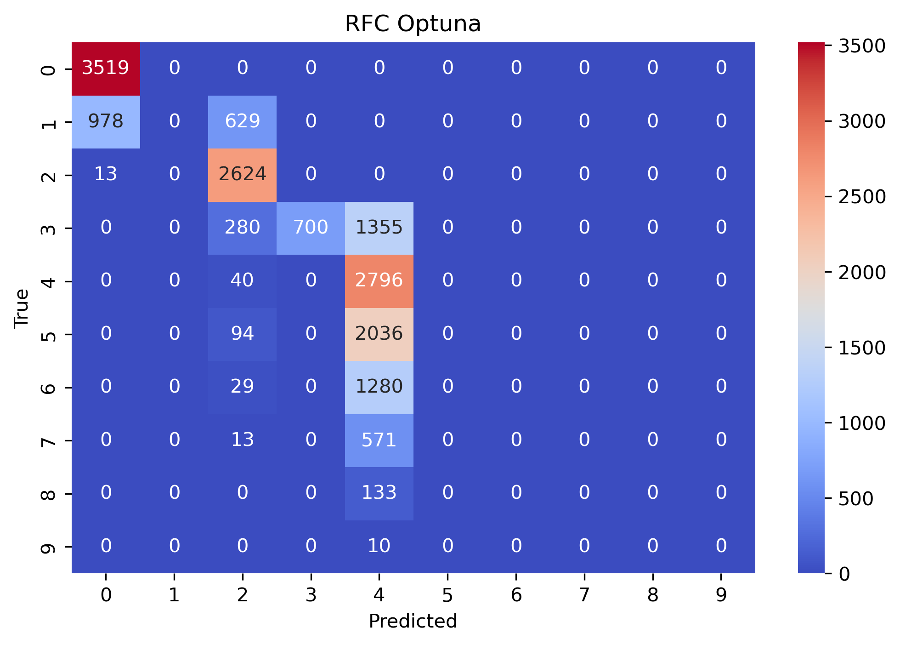

<div align="center">

# :bar_chart: Bayesian Optimization Comparison


</div>

Ever wondered which bayesian optimization framework to use for your project? We try to help you with that :)  

> This repository provides a general comparison of different [bayesian optimization](https://en.wikipedia.org/wiki/Bayesian_optimization) frameworks. 

## :books: Table of Contents
- [:bar\_chart: Bayesian Optimization Comparison](#bar_chart-bayesian-optimization-comparison)
  - [:books: Table of Contents](#books-table-of-contents)
- [:dart: Summary](#dart-summary)
  - [Huggingface's Spotify Tracks Dataset](#huggingfaces-spotify-tracks-dataset)
    - [(1) RandomForestClassifier](#1-randomforestclassifier)
  - [Installation](#installation)
  - [:bulb: Library Descriptions](#bulb-library-descriptions)
    - [:one: Optuna](#one-optuna)
    - [:two: BayesianOptimization](#two-bayesianoptimization)
    - [:three: BayesSearchCV](#three-bayessearchcv)
    - [:four: hyperopt](#four-hyperopt)
    - [:five: gp\_minimize](#five-gp_minimize)

# :dart: Summary

## Huggingface's [Spotify Tracks Dataset](https://huggingface.co/datasets/maharshipandya/spotify-tracks-dataset)

- Number of rows: `114,000`
  - Train: `77,520`
  - Validation: `19,380`
  - Test: `17,100`
- Number of features: `15`
- Target feature: `popularity`
  - Number of distinct values: `10`

We used [Huggingfaces spotify tracks dataset](https://huggingface.co/datasets/maharshipandya/spotify-tracks-dataset). The objective was to predict the `popularity` of a mobile device. It is about a 10-class classification problem. We performed a short EDA on the dataset: [huggingface__spotify_tracks/eda.ipynb](https://github.com/PeeteKeesel/bayes-opt-battle/blob/9480eb9682e382fdd7bbe9e5efd4c981f2fb6173/notebooks/huggingface__spotify_tracks/eda.ipynb).

### (1) RandomForestClassifier

The following shows the results on the `Test` set. 

<u>n-trials: 50</u>

<details>
  <summary>Train</summary>


| Library                | Tune Time | Precision | Recall | F1-Score | Notebook |
| ---------------------- | ---- | ---- | ---- | ---- | ---- | 
| `Baseline`             | None | `0.9817` | `0.9590` | `0.9698` | [baselines.ipynb](https://github.com/PeeteKeesel/bayes-opt-battle/blob/9480eb9682e382fdd7bbe9e5efd4c981f2fb6173/notebooks/huggingface__spotify_tracks/baselines.ipynb) |
| `Optuna`               | 6m2s  | `0.2839` | `0.3002` | `0.2292` | [optuna.ipynb](https://github.com/PeeteKeesel/bayes-opt-battle/blob/9480eb9682e382fdd7bbe9e5efd4c981f2fb6173/notebooks/huggingface__spotify_tracks/optuna.ipynb) |
| `BayesianOptimization` | | | | | [bayesianoptimization.ipynb](https://github.com/PeeteKeesel/bayes-opt-battle/blob/9480eb9682e382fdd7bbe9e5efd4c981f2fb6173/notebooks/huggingface__spotify_tracks/bayesianoptimization.ipynb) |
| `BayesSearchCV`        | | | | | [bayessearchcv.ipynb](https://github.com/PeeteKeesel/bayes-opt-battle/blob/9480eb9682e382fdd7bbe9e5efd4c981f2fb6173/notebooks/huggingface__spotify_tracks/bayessearchcv.ipynb) |
| `hyperopt`             | | | | | [hyperopt.ipynb](https://github.com/PeeteKeesel/bayes-opt-battle/blob/9480eb9682e382fdd7bbe9e5efd4c981f2fb6173/notebooks/huggingface__spotify_tracks/hyperopt.ipynb) |
| `gp_minimize`          | | | | | [gpminimize.ipynb](https://github.com/PeeteKeesel/bayes-opt-battle/blob/9480eb9682e382fdd7bbe9e5efd4c981f2fb6173/notebooks/huggingface__spotify_tracks/gpminimize.ipynb) |

</details>

<details open>
  <summary>Test</summary>


| Library                | Tune Time | Precision | Recall | F1-Score | Notebook |
| ---------------------- | ---- | ---- | ---- | ---- | ---- | 
| `Baseline`             | None | `0.6632` | `0.5680` | `0.6044` | [baselines.ipynb](https://github.com/PeeteKeesel/bayes-opt-battle/blob/9480eb9682e382fdd7bbe9e5efd4c981f2fb6173/notebooks/huggingface__spotify_tracks/baselines.ipynb) |
| `Optuna`               | 6m2s  | `0.2835` | `0.3008` | `0.2304` | [optuna.ipynb](https://github.com/PeeteKeesel/bayes-opt-battle/blob/9480eb9682e382fdd7bbe9e5efd4c981f2fb6173/notebooks/huggingface__spotify_tracks/optuna.ipynb) |
| `BayesianOptimization` | | | | | [bayesianoptimization.ipynb](https://github.com/PeeteKeesel/bayes-opt-battle/blob/9480eb9682e382fdd7bbe9e5efd4c981f2fb6173/notebooks/huggingface__spotify_tracks/bayesianoptimization.ipynb) |
| `BayesSearchCV`        | | | | | [bayessearchcv.ipynb](https://github.com/PeeteKeesel/bayes-opt-battle/blob/9480eb9682e382fdd7bbe9e5efd4c981f2fb6173/notebooks/huggingface__spotify_tracks/bayessearchcv.ipynb) |
| `hyperopt`             | | | | | [hyperopt.ipynb](https://github.com/PeeteKeesel/bayes-opt-battle/blob/9480eb9682e382fdd7bbe9e5efd4c981f2fb6173/notebooks/huggingface__spotify_tracks/hyperopt.ipynb) |
| `gp_minimize`          | | | | | [gpminimize.ipynb](https://github.com/PeeteKeesel/bayes-opt-battle/blob/9480eb9682e382fdd7bbe9e5efd4c981f2fb6173/notebooks/huggingface__spotify_tracks/gpminimize.ipynb) |

</details>


<u>n-trials: 100</u>

<details>
  <summary>Train</summary>


| Library                | Tune Time | Precision | Recall | F1-Score | Notebook |
| ---------------------- | ---- | ---- | ---- | ---- | ---- | 
| `Baseline`             | None | `0.9817` | `0.9590` | `0.9698` | [baselines.ipynb](https://github.com/PeeteKeesel/bayes-opt-battle/blob/9480eb9682e382fdd7bbe9e5efd4c981f2fb6173/notebooks/huggingface__spotify_tracks/baselines.ipynb) |
| `Optuna`               | 6m2s  |  |  |  | [optuna.ipynb](https://github.com/PeeteKeesel/bayes-opt-battle/blob/9480eb9682e382fdd7bbe9e5efd4c981f2fb6173/notebooks/huggingface__spotify_tracks/optuna.ipynb) |
| `BayesianOptimization` | | | | | [bayesianoptimization.ipynb](https://github.com/PeeteKeesel/bayes-opt-battle/blob/9480eb9682e382fdd7bbe9e5efd4c981f2fb6173/notebooks/huggingface__spotify_tracks/bayesianoptimization.ipynb) |
| `BayesSearchCV`        | | | | | [bayessearchcv.ipynb](https://github.com/PeeteKeesel/bayes-opt-battle/blob/9480eb9682e382fdd7bbe9e5efd4c981f2fb6173/notebooks/huggingface__spotify_tracks/bayessearchcv.ipynb) |
| `hyperopt`             | | | | | [hyperopt.ipynb](https://github.com/PeeteKeesel/bayes-opt-battle/blob/9480eb9682e382fdd7bbe9e5efd4c981f2fb6173/notebooks/huggingface__spotify_tracks/hyperopt.ipynb) |
| `gp_minimize`          | | | | | [gpminimize.ipynb](https://github.com/PeeteKeesel/bayes-opt-battle/blob/9480eb9682e382fdd7bbe9e5efd4c981f2fb6173/notebooks/huggingface__spotify_tracks/gpminimize.ipynb) |

</details>

<details open>
  <summary>Test</summary>


| Library                | Tune Time | Precision | Recall | F1-Score | Notebook |
| ---------------------- | ---- | ---- | ---- | ---- | ---- | 
| `Baseline`             | None | `0.6632` | `0.5680` | `0.6044` | [baselines.ipynb](https://github.com/PeeteKeesel/bayes-opt-battle/blob/9480eb9682e382fdd7bbe9e5efd4c981f2fb6173/notebooks/huggingface__spotify_tracks/baselines.ipynb) |
| `Optuna`               |   |  |  |  | [optuna.ipynb](https://github.com/PeeteKeesel/bayes-opt-battle/blob/9480eb9682e382fdd7bbe9e5efd4c981f2fb6173/notebooks/huggingface__spotify_tracks/optuna.ipynb) |
| `BayesianOptimization` | | | | | [bayesianoptimization.ipynb](https://github.com/PeeteKeesel/bayes-opt-battle/blob/9480eb9682e382fdd7bbe9e5efd4c981f2fb6173/notebooks/huggingface__spotify_tracks/bayesianoptimization.ipynb) |
| `BayesSearchCV`        | | | | | [bayessearchcv.ipynb](https://github.com/PeeteKeesel/bayes-opt-battle/blob/9480eb9682e382fdd7bbe9e5efd4c981f2fb6173/notebooks/huggingface__spotify_tracks/bayessearchcv.ipynb) |
| `hyperopt`             | | | | | [hyperopt.ipynb](https://github.com/PeeteKeesel/bayes-opt-battle/blob/9480eb9682e382fdd7bbe9e5efd4c981f2fb6173/notebooks/huggingface__spotify_tracks/hyperopt.ipynb) |
| `gp_minimize`          | | | | | [gpminimize.ipynb](https://github.com/PeeteKeesel/bayes-opt-battle/blob/9480eb9682e382fdd7bbe9e5efd4c981f2fb6173/notebooks/huggingface__spotify_tracks/gpminimize.ipynb) |

</details>


<table>
  <tr>
    <td></td>
    <td></td>
    <td></td>
    <td></td>
    <!-- <td></td> -->
  </tr>
  <!-- <tr>
    <td></td>
    <td></td>
    <td></td>
  </tr>
  <tr>
    <td></td>
    <td></td>
    <td></td>
  </tr> -->
</table>


<details>
  <summary>See detailed summary:</summary>

- `Baseline` | [baselines.ipynb](https://github.com/PeeteKeesel/bayes-opt-battle/blob/9480eb9682e382fdd7bbe9e5efd4c981f2fb6173/notebooks/huggingface__spotify_tracks/baselines.ipynb)
```
    Performance Results : RandomForestClassifier 
    ========================================
                    Train     Test      Delta(train,test)   
        Accuracy  : 0.9867    0.5579       -0.4289
        Precision : 0.9817    0.6632       -0.3185
        Recall    : 0.9590    0.5680       -0.3910
        F1-Score  : 0.9698    0.6044       -0.3653

Tuning time: None, since no tuning has been performed
```

- `Optuna` | [optuna.ipynb](https://github.com/PeeteKeesel/bayes-opt-battle/blob/9480eb9682e382fdd7bbe9e5efd4c981f2fb6173/notebooks/huggingface__spotify_tracks/optuna.ipynb)
```
50 trials
Optuna Results
==============
                Train     Test      Delta(train,test)   
    Accuracy  : 0.5235    0.5239        0.0004
    Precision : 0.2844    0.2842       -0.0002
    Recall    : 0.2990    0.2993        0.0003
    F1-Score  : 0.2264    0.2273        0.0009

Tuning time: 6 min 24 sec
```

- `BayesSearchCV` | [bayessearchcv.ipynb](https://github.com/PeeteKeesel/bayes-opt-battle/blob/9480eb9682e382fdd7bbe9e5efd4c981f2fb6173/notebooks/huggingface__spotify_tracks/bayessearchcv.ipynb)
```
TODO
```

- `BayesianOptimization` | [bayesianoptimization.ipynb](https://github.com/PeeteKeesel/bayes-opt-battle/blob/9480eb9682e382fdd7bbe9e5efd4c981f2fb6173/notebooks/huggingface__spotify_tracks/bayesianoptimization.ipynb)
```
5 trials
BayesianOptimization Results
============================
                Train     Test      Delta(train,test)   
    Accuracy  : 0.4859    0.4874        0.0015
    Precision : 0.2789    0.2779       -0.0010
    Recall    : 0.2744    0.2753        0.0010
    F1-Score  : 0.2060    0.2066        0.0006

Tuning time: 0 min 23 sec
```

- `hyperopt` | [hyperopt.ipynb](https://github.com/PeeteKeesel/bayes-opt-battle/blob/9480eb9682e382fdd7bbe9e5efd4c981f2fb6173/notebooks/huggingface__spotify_tracks/hyperopt.ipynb)
```
5 trials
Hyperopt Results
===============
                Train     Test      Delta(train,test)   
    Accuracy  : 0.2058    0.2058       -0.0000
    Precision : 0.0206    0.0206       -0.0000
    Recall    : 0.1000    0.1000        0.0000
    F1-Score  : 0.0341    0.0341       -0.0000

Tuning time: 0 min 30 sec
```

- `gp_minimize` | [gpminimize.ipynb](https://github.com/PeeteKeesel/bayes-opt-battle/blob/9480eb9682e382fdd7bbe9e5efd4c981f2fb6173/notebooks/huggingface__spotify_tracks/gpminimize.ipynb)
```
TODO
```

</details>

## Installation

To install the conda environment with conda, run the following command:

```bash
conda env create -f environment.yml
```

## :bulb: Library Descriptions
### :one: [Optuna](https://optuna.org/)

```bash
# Pip
% pip install optuna
# Conda
% conda install -c conda-forge optuna
```

In Optuna you need to define an objective, create a study via [create_study]() and optimize your objective. An example implementation would be as follows:

```python
def objective(trial):
    # Defining the hyperparameter search space.
    n_estimators = trial.suggest_int('n_estimators', 50, 300)
    # ...
    
    # Build the pipeline
    clf = RandomForestClassifier(n_estimators=n_estimators,
                                 # ...  
                                 )
    
    clf.fit(X_train, y_train)
    y_pred = clf.predict(X_val)
    acc = accuracy_score(y_val, y_pred)
    
    return acc

# Creating a study and running Optuna optimization.
study = optuna.create_study(study_name='my_optuna_study',
                            direction='maximize')
study.optimize(objective, 
               n_trials=100)

# Obtain the best found parameters.
best_params = study.best_params
```


While tuning Optuna provides logs in the following format. This shows the log of the 1st, 150th and last trial:

```
[I 2023-08-07 16:07:39,539] A new study created in memory with name: my_optuna_study
[I 2023-08-07 16:07:39,809] Trial 0 finished with value: 0.1864406779661017 and parameters: {'n_estimators': 158, 'max_depth': 10, 'min_samples_split': 0.578748660317236, 'min_samples_leaf': 0.12410371173766938}. Best is trial 0 with value: 0.1864406779661017.
...
[I 2023-08-07 16:08:21,456] Trial 150 finished with value: 0.1694915254237288 and parameters: {'n_estimators': 271, 'max_depth': 3, 'min_samples_split': 0.38567485569136783, 'min_samples_leaf': 0.13389811287208112}. Best is trial 55 with value: 0.22033898305084745.
...
[I 2023-08-07 16:09:02,867] Trial 299 finished with value: 0.1864406779661017 and parameters: {'n_estimators': 139, 'max_depth': 8, 'min_samples_split': 0.4866643968671017, 'min_samples_leaf': 0.19301363057724275}. Best is trial 55 with value: 0.22033898305084745.
```

### :two: [BayesianOptimization](https://github.com/bayesian-optimization/BayesianOptimization)

```bash
# Pip
$ pip install bayesian-optimization
# Conda
$ conda install -c conda-forge bayesian-optimization
```

### :three: [BayesSearchCV](https://scikit-optimize.github.io/stable/modules/generated/skopt.BayesSearchCV.html)

```bash
# Pip
$ pip install scikit-optimize
# Conda
% conda install -c conda-forge scikit-optimize
```

### :four: [hyperopt](http://hyperopt.github.io/hyperopt/)

```bash
# Pip
% pip install hyperopt
# Conda
% conda install -c conda-forge hyperopt
```

### :five: [gp_minimize](https://scikit-optimize.github.io/stable/modules/generated/skopt.gp_minimize.html)

```bash
# Pip
$ pip install scikit-optimize
# Conda
% conda install -c conda-forge scikit-optimize
```
